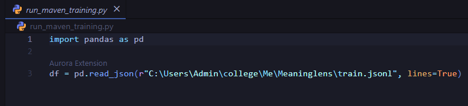
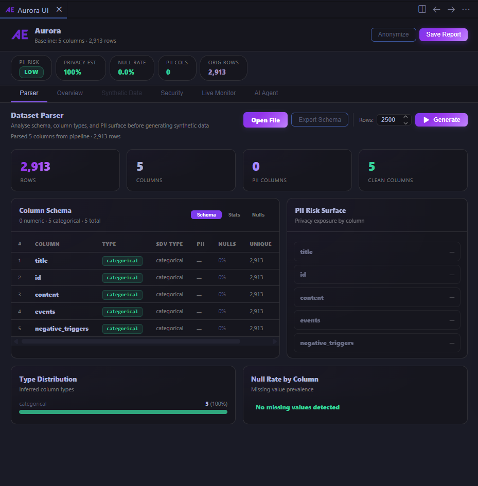
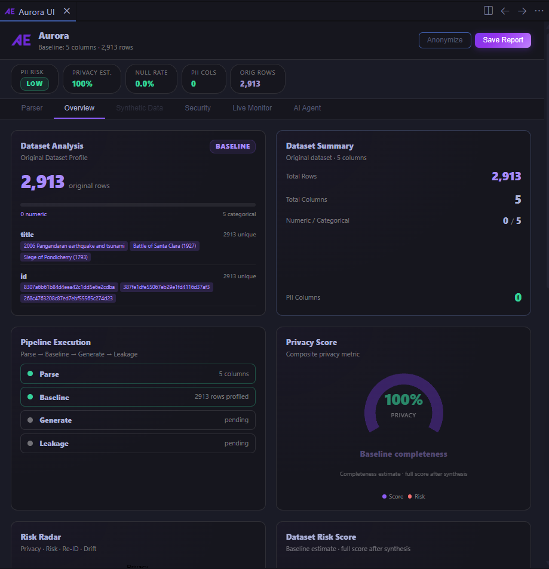
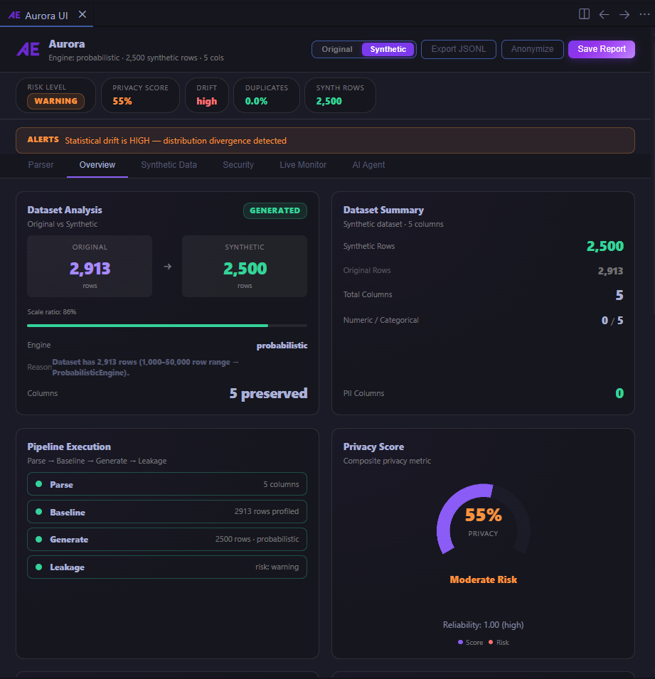
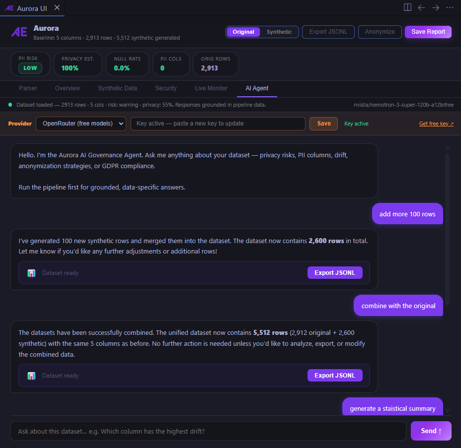
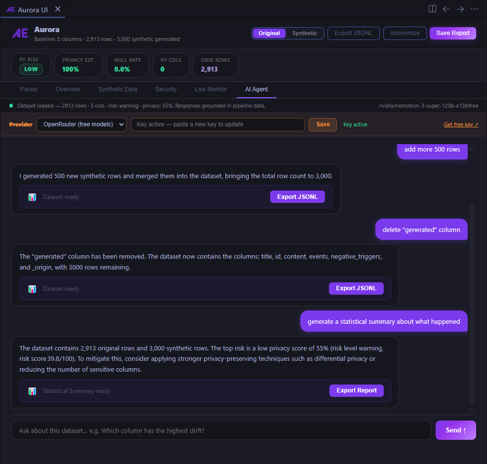

<div align="center">


# Aurora

### Privacy-Safe Synthetic Data, Generated Where Your Data Already Lives

<br/>

[](https://code.visualstudio.com/)
[](https://www.typescriptlang.org/)
[](https://python.org/)
[](LICENSE)
[]()

<br/>

**Aurora turns any dataset you open in VS Code into a privacy-safe synthetic copy** — schema profiling, synthetic generation, PII scanning, and AI-powered governance reports, all running locally. No data ever leaves your machine.

[Features](#features) · [Screenshots](#screenshots) · [How It Works](#how-it-works) · [Installation](#installation) · [Configuration](#configuration) · [Architecture](#architecture)

</div>

---

## Why Aurora

- **Zero data exposure** — everything runs locally on your machine; nothing is uploaded anywhere.
- **One click from your code** — Aurora detects `pd.read_csv(...)` and similar calls the moment you write them.
- **Built-in guardrails** — synthetic output only ships after it passes a strict, automated validation pipeline.
- **Plain-language governance** — ask an AI assistant about your dataset's privacy risk instead of reading raw metrics.

---

## Features

| | Feature | What it does |
|---|---|---|
| 🔍 | **Inline Detection** | Recognizes dataset-loading code and adds a one-click action right above it |
| 📊 | **Dataset Explorer** | Shows schema, column types, null rates, and sample values in seconds |
| ⚗️ | **Synthetic Data Generation** | Automatically picks the right engine for your dataset size — statistical, copula-based, or GAN-based |
| ✅ | **Automated Validation** | Every synthetic batch is checked for quality, duplicates, and realism before it's accepted |
| 🛡️ | **Privacy & Security Scanning** | Flags PII, exposed secrets, and re-identification risk |
| 🤖 | **AI Governance Analyst** | Chat with an AI assistant about your dataset's privacy posture and get a full report |
| 📡 | **Live Progress Monitor** | Watch generation happen in real time, with stats as each batch completes |
| 📋 | **Dataset Cards** | Auto-generated documentation for every dataset you analyze |

---

## Screenshots

<div align="center">

**Detection happens inline — no setup, no separate tool**
<br/>


<br/><br/>

**One click opens a full dataset overview**
<br/>


<br/><br/>

**Compare original vs. synthetic data side by side**
<br/>



<br/><br/>

**Ask the built-in AI analyst about your data's privacy risk**
<br/>



</div>

---

## How It Works

Aurora pairs a lightweight VS Code extension with a local Python engine. The two talk to each other directly on your machine — there's no server and no network call involved.

```
 You write:  pd.read_csv("customers.csv")
                       │
                       ▼
          Aurora detects it instantly
                       │
                       ▼
        Reads the schema & builds a
       statistical profile of your data
                       │
                       ▼
     Generates a synthetic version using
      the right engine for your dataset
                       │
                       ▼
     Validates it — quality, duplicates,
        realism, and privacy checks
                       │
                       ▼
     Delivers the synthetic dataset, a
      privacy report, and an AI summary
```

---

## Trust & Safety

Before any synthetic data is handed back to you, it passes through a layered validation system — think of it as quality control for AI-generated data:

| Check | What it guards against |
|---|---|
| **Quality & Constraint Repair** | Invalid values, broken formats, out-of-range numbers |
| **Duplicate Detection** | Synthetic rows that are exact copies of real ones |
| **Overfitting Detection** | Synthetic data that's *too close* to the original (a privacy risk) |
| **Diversity Check** | Synthetic data that's collapsed into repetitive, low-variety values |
| **Privacy & Leakage Gate** | Re-identification risk and membership-inference exposure |
| **Integrity Assertion** | Confirms the data you receive is exactly what passed validation — nothing altered afterward |

If any check fails, generation stops and nothing is released. This entire pipeline is covered by an automated test suite that runs before every release.

---

## Installation

### Requirements

- **Node.js** ≥ 18
- **Python** ≥ 3.10
- **VS Code** ≥ 1.70.0
- An API key for one LLM provider *(optional — only needed for the AI Insights feature)*

### Setup

```bash
git clone https://github.com/your-org/aurora.git
cd aurora

npm install
pip install -r requirements.txt
npm run compile
```

Open the folder in VS Code and press **F5** to launch it. Aurora activates automatically the next time you open a Python file.

---

## Configuration

### AI Insights — LLM Provider

Set an API key for any one of the supported providers, either in the AI Insights panel or as an environment variable:

| Provider | Environment Variable |
|---|---|
| OpenRouter | `OPENROUTER_API_KEY` |
| OpenAI | `OPENAI_API_KEY` |
| Anthropic | `ANTHROPIC_API_KEY` |
| Groq | `GROQ_API_KEY` |
| Together AI | `TOGETHER_API_KEY` |
| Mistral | `MISTRAL_API_KEY` |

### VS Code Settings

| Setting | Default | Description |
|---|---|---|
| `idelense.pythonPath` | `python3` | Path to the Python executable Aurora uses |
| `idelense.pipelinePath` | `""` | Path to the extension root — leave empty to auto-detect |
| `automate.openrouterApiKey` | `""` | OpenRouter key for AI Insights |

---

## Architecture

Aurora's synthetic data engine sits behind a 15-layer governance model, covering everything from ingestion to compliance reporting. The AI assistant only ever sees structured summaries of these layers — never your raw data.

```
 Ingestion → Cataloging → Profiling → Schema Intelligence
      → Sensitive Data Detection → Data Quality Checks
      → Privacy Risk Scoring → Re-Identification Modeling
      → Synthetic Risk Detection → Reliability Analysis
      → Lineage Tracking → Governance Policy Engine
      → Policy Authoring → Compliance Enforcement
      → Monitoring & Audit
```

### Project Structure

```
aurora/
├── src/
│   ├── ai/            → LLM client, agent logic, context building
│   ├── security/       → PII/secrets scanning, alerting
│   ├── webview/ui/      → Dashboard tabs (overview, security, synthetic, live monitor)
│   └── utils/          → Python pipeline: generation, validation, enforcement
├── docs/               → Screenshots and feature documentation
├── policy.yaml          → Governance policy definitions
├── requirements.txt
└── package.json
```

---

## Roadmap

- [x] Automated validation & enforcement pipeline
- [x] Signed, tamper-proof model cache
- [x] Overfitting & distribution-collapse detection
- [x] Cross-run drift tracking
- [x] Full automated proof-test suite

---

## Contributing

1. Fork the repository
2. Create a feature branch: `git checkout -b feature/your-feature`
3. Commit your changes: `git commit -m "feat: description"`
4. Open a pull request against `main`

---

## License

Licensed under the [MIT License](LICENSE).

<div align="center">
  <sub>Built for ML engineers and data scientists who care about privacy.</sub>
</div>
